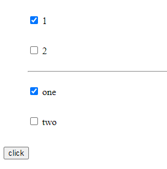

# Vue中dom元素复用问题

## 1 什么是dom元素复用

在v-if，v-else条件渲染中最早遇到了vue中dom元素复用导致渲染后出现与预期不符的结果例如：

代码：

```html
<div id="root">
    <div v-if="this.state">
        <label>用户：</label>
        <input type="text" placeholder="请输入用户名">
    </div>
    <div v-else>
        <label>邮箱：</label>
        <input type="text" placeholder="请输入邮箱名">
    </div>
    <button @click="handleClick">toggle</button>
</div>
```

假设上述代码要实现这样的功能，用户打开页面后可以选择用户名或邮箱任一方式的登录，按下toggle按钮后，input框中应为空白由用户自行输入。如下图所示：

按下按钮前：


预期结果：


可实际情况如下，当用户在input输入框中输入任何字符后点击toggle按钮，之前的输入会被记录到切换后的input输入框中，如下图所示：

按下按钮前：


实际结果：


## 2 原因

vue为了解决频繁操作dom元素带来的延迟运算成本等因素，采用虚拟dom元素的概念，会复用已经创建好的虚拟dom元素（同名标签）并最终渲染成真实dom元素到页面上。

## 3 解决办法

1. 将v-if、v-else改为v-show

   因为v-show同v-if有着本质的区别，他会事先创建好root下的两个div标签，只不过通过display属性控制显示。只改变display属性也就不存在创建dom元素并复用的问题

2. 加入key标签

   代码修改如下：

   ```html
   <div id="root">
       <div v-if="this.state">
           <label>用户：</label>
           <input type="text" placeholder="请输入用户名" 		key="userInput">
       </div>
       <div v-else>
           <label>邮箱：</label>
           <input type="text" placeholder="请输入邮箱名" 		key="emailInput">
       </div>
       <button @click="handleClick">toggle</button>
   </div>
   ```

## 4 另一个例子（v-for渲染）

### 实现功能：

将2个数组中的内容渲染到ul列表中（以水平分割线分割），按下按钮后将数组arr1中第一个元素移入数组arr2中。

```html
<div id="root">
    <ul>
        <child v-for="item in arr1" :msg="item.txt" >
        </child>
        <hr>
        <child v-for="item in arr2" :msg="item.txt" >			</child>
    </ul>
    <button @click="handleClick">click</button>
</div>
<script>
        Vue.component("child",{
            props:["msg"],
            template:`
                <li>
                <input type="checkbox" name="" id="">
                <p>{{msg}}</p>
                </li>
            `
        })
</script>
```

上述功能实现起来不复杂，但当用户点击了input单选框后，会因为渲染存在异常

第一步，勾选后：



第二步，点击按钮后：


第三步，再次点击按钮后：


上述dom元素复用，个人理解如下：系统按照先后顺序创建了4个input单选框，当用户勾选后，这4个单选框中被勾选的有了checked属性，当v-for开始循环，按照子组件生成顺序依次去取。由于勾选的是第一个和第三个input单选框，即始终是第一、三个子组件前input单选框为勾选状态。

### 打个不恰当的比方：

a,b,c,d4个小朋友每个人拿到一本本子（虚拟dom元素），a，c在本子上乱涂乱画了，b，d没动；老师按照a,b,c,d的顺序把本子收了回去，并让a,b,c,d按照b,c,d,a的顺序排队，将分子依次分发下去，后续本子的收取顺序不改变，只是小朋友排队领取的排队顺序发生改变。

解决方法：给每本本子一开始就写上拥有者独一无二的姓名，不管小朋友怎么排序，都按照该独一无二的姓名分发下去（这就是前面提到的key属性）

### 做些改变：

如果上述代码中html结构变化，变成如下结构：

```html
<div id="root">
    <ul>
        <child v-for="item in arr1" :msg="item.txt" 			key="item.id"></child>
        <hr>
    </ul>
    <ul>
        <child v-for="item in arr2" :msg="item.txt" 			key="item.id"></child>
    </ul>
    <button @click="handleClick">click</button>
</div>
```

第一步：勾选input框后


第二步：单击按钮后


第三步：再次点击按钮后


同前面的比方，这里的区别是arr1和arr2不再是同一个父标签，可以看做是abcd4个小朋友在两个班级中，A班级发了两本本子给a、b；B班级发了2本本子给c、d；班级内的操作和发放本子逻辑与之前相同，但是当a、b被移入B班级后，会发放新的本子（创建新的虚拟dom元素）

注：

* 不打比方地说就是非同一父标签下的同名dom元素不会被复用，只有辈分相同的同名dom元素才会被复用。

* 在写key的时候注意 key=“...”和  :key=“...”的区别，前者只是给dom元素添加属性key值，“ ”内的是字符串，而后者是v-bind绑定，即将值绑定到key属性上，可以是数值、字符串也可以是js语句，可以用vue的相关内容

因而如果在为组件或dom元素添加key属性时，写成了如下格式

```js
<child v-for="item in arr" key="item.id">
```

表面看是给了key，但实际分配给子组件的key是一个字符串“item.id”，并非所预想的数组中元素存储的id

正确的应该是：

```js
<child v-for="item in arr" :key="item.id">
```

